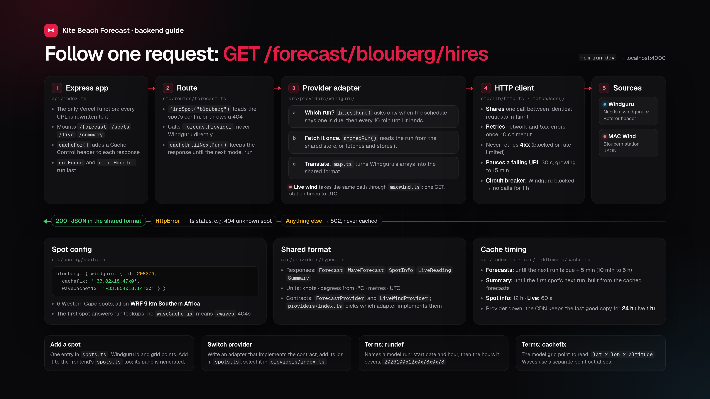
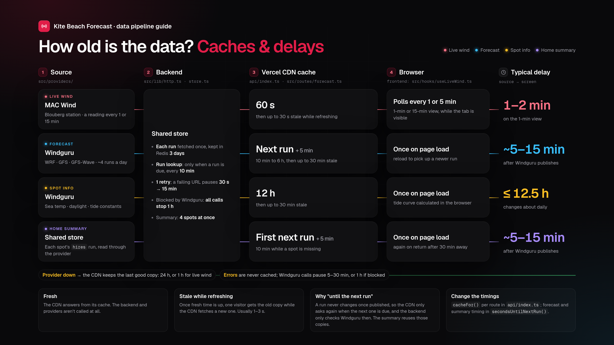
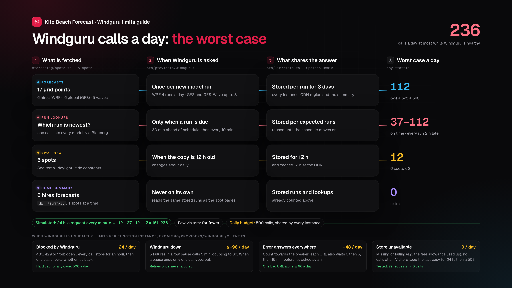

<div align="center">
  <picture>
    <source media="(prefers-color-scheme: dark)" srcset="https://raw.githubusercontent.com/MikaelRothig/weather-station-dashboard-frontend/main/src/assets/brand/wordmark-on-dark.svg" />
    
  </picture>
</div>
<br />
<p align="center">
    The API behind Kite Beach Forecast, for kite spots in the Western Cape, South Africa. It collects forecasts, tides and live wind from several providers and serves them in one consistent format.
</p>

## Getting started

You need Node.js 18 or newer. To see the data in the app, also set up the [frontend](https://github.com/mikaelrothig/weather-station-dashboard-frontend).

```sh
npm install
npm run dev
```

The API runs at `http://localhost:4000`. Set `PORT` in a `.env` file to use a different port.

To use the shared store locally, copy the store's `KV_REST_API_URL` and `KV_REST_API_TOKEN` into `.env` (or run `vercel env pull .env`). Locally the store is optional: without it the API calls Windguru directly. Deployed, it's required (see below).

| Script | What it does |
|---|---|
| `npm run dev` | Starts the API with ts-node |
| `npm run typecheck` | Checks the types without building |
| `npm run build` | Compiles to `dist/` |
| `npm start` | Runs the compiled build |

## API

Every response uses the same units, whichever provider the data came from:

- wind speed in knots
- directions in degrees the wind or swell comes from
- temperatures in °C and heights in metres
- timestamps in ISO 8601 (UTC); sunrise and sunset are the spot's local clock time

The response types are defined in `src/providers/types.ts`.

| Route | Returns |
|---|---|
| `GET /forecast/:spot/hires` | The high-resolution forecast (WRF 9 km Southern Africa) |
| `GET /forecast/:spot/global` | The long-range forecast (GFS 13 km) |
| `GET /forecast/:spot/waves` | The swell forecast (GFS-Wave). Returns 404 for spots without swell, such as Langebaan's lagoon |
| `GET /spots/:spot` | Sea temperature, sunrise and sunset, and tide data |
| `GET /summary` | Every spot's high-resolution forecast for today and tomorrow (South African time), for the home page. A spot that fails comes back as `{ spot, error }` while the rest still load |
| `GET /live/1min` | Recent 1-minute readings from the Blouberg station, newest first |
| `GET /live/15min` | Recent 15-minute readings from the Blouberg station, newest first |

`:spot` is the spot's name, for example `blouberg` or `mistycliffs`. An unknown spot returns a 404. If a provider is unavailable, the API returns a 502.

## How it works



A request passes through four layers:

1. **Express app** (`api/index.ts`) sets cache headers and turns errors into JSON responses.
2. **Route** (`src/routes/`) looks up the spot and asks a provider for the data. Routes never call Windguru or MAC Wind directly.
3. **Provider adapter** (`src/providers/`) fetches the data and converts it to the shared format.
4. **HTTP client** (`src/lib/http.ts`) makes the request. It retries network and server errors, shares one call between identical requests, and pauses a failing URL for longer each time (30 seconds up to 15 minutes).

```
api/
└── index.ts              Express app (the only Vercel function)
src/
├── config/spots.ts       Every spot and each provider's ids for it
├── routes/               Request handlers that only talk to the provider interfaces
├── providers/
│   ├── types.ts          The shared format and the provider interfaces
│   ├── index.ts          Chooses which provider serves each kind of data
│   ├── windguru/         Forecasts, sea temperature and tides
│   └── macwind.ts        Live readings from the MAC Wind station
├── middleware/           Cache headers and error responses
├── lib/http.ts           Timeouts, retries and failure handling for provider calls
└── lib/store.ts          The shared Redis store (optional)
```

## Common tasks

### Add a spot

Add an entry to `src/config/spots.ts` with the spot's Windguru spot id and model grid points:

```ts
blouberg: { windguru: { id: 208276, cachefix: '-33.82x18.47x0', waveCachefix: '-33.854x18.147x0' } },
```

Leave out `waveCachefix` for spots without swell. Adding a spot adds no run lookups, only its own forecasts.

In the frontend, add the spot to `src/config/spots.ts` (its page is generated from that list) and run `npm run outlines` if it falls outside the home page map.

### Switch data provider

1. Add an adapter under `src/providers/` that implements `ForecastProvider` or `LiveWindProvider` and converts the provider's data to the types in `types.ts`.
2. Add the provider's ids for each spot to `src/config/spots.ts`, next to the `windguru` block.
3. Select the new adapter in `src/providers/index.ts`.

The routes and the frontend don't need to change.

## Caching and delays



Vercel's CDN caches each response, so the providers are only called when the cached copy expires:

| Data | Cached for | If the provider is down |
|---|---|---|
| Forecasts | Until the next model run is due, plus 5 minutes (between 10 minutes and 6 hours) | The last good copy is served for up to 24 hours |
| Summary | Until the first spot's next model run is due; 10 minutes while a spot is missing | The last good copy is served for up to 24 hours |
| Spot info | 12 hours | The last good copy is served for up to 24 hours |
| Live wind | 60 seconds | The last good copy is served for up to 1 hour |

Errors are never cached. Each route's cache policy is set with `cacheFor()` in `api/index.ts`, and the forecast timing is in `src/routes/forecast.ts`.

### Shared store and Windguru limits

The CDN caches per region, and each function instance has its own memory, so on their own they'd fetch the same data from Windguru several times. A shared Redis store (Upstash, connected to the Vercel project as `KV_REST_API_URL` and `KV_REST_API_TOKEN`) prevents that:

- **Forecasts** are stored per model run. A published run never changes, so each one is fetched from Windguru once and every region and instance reads the stored copy. Runs expire after 3 days.
- **Which run is newest** is asked through the first spot, since one answer covers every model, and only when a run is due (`src/providers/windguru/runs.ts`). The answer is stored under the runs the publishing schedule expects half an hour ahead, so it's reused until one of those changes. If a model's expected run isn't out yet, it's asked again every 10 minutes until it is. New runs still show up within 10 minutes of publishing, for about 10–60 lookups a day instead of 144 (simulated: 37 with runs on schedule, 112 with every run 2 hours late).
- **Spot info** is stored for 12 hours.

Calls to Windguru also go through three limits (`src/providers/windguru/client.ts`). In every case visitors keep getting the CDN's last good copy.

- **Circuit breaker.** If Windguru blocks or rate-limits the API, every call stops for an hour. After 5 failures in a row (timeouts, 5xx or error answers), calls stop for 5 minutes, doubling up to 30 while it keeps failing. When a pause ends, a single call checks whether Windguru is back and every other request waits for it, so a pause ending never lets a burst through. Each call retries at most once.
- **Error answers.** A URL Windguru answers with an error (for example a run it can't serve yet) isn't asked again for 1, then 5, then 15 minutes.
- **Daily budget.** At most 500 HTTP calls to Windguru a day (UTC), counted in the store across every instance and region, retries included. A healthy day needs at most about 240. Change it with `WINDGURU_DAILY_BUDGET`.



With the store, Windguru sees at most about 240 calls a day however many people visit:

| Calls a day | Worst case |
|---|---|
| Forecasts: 6 WRF × 4 runs, 6 GFS × 8, 5 GFS-Wave × 8 | 112 |
| Run lookups (37 with runs on time, 112 if every run is 2 hours late) | 37–112 |
| Spot info: 6 spots × 2 | 12 |
| **Total** | **about 160–240** |

With little traffic most of these never happen, since a forecast is only fetched once someone asks for it. Whatever happens, the budget caps it at 500.

**Deployed, the store is required.** If it's missing (the environment variables aren't set) or failing (for example the free allowance is used up), the API makes no Windguru calls at all and answers 503; after a store error it leaves the store alone for a minute. Visitors keep the CDN's last good copy for up to 24 hours, then see the data as unavailable until the store is back. This keeps a misconfigured deploy from ever flooding Windguru. Set `REQUIRE_STORE=false` to allow direct calls without a store, or `true` to require it locally.

The summary reads each spot's forecast through the provider, four spots at a time, so it gets each run from the shared store like the spot pages do and adds almost no Windguru calls of its own.

## Deployment

The backend deploys to Vercel. `vercel.json` sends every request to `api/index.ts`.

Vercel turns every file under `api/` into its own serverless function, and the Hobby plan allows at most 12. Keep `api/` to the single entry point and put all other code in `src/`.

## Diagrams

The HTML sources for the images are in `docs/diagrams/`. Update them when the code they describe changes.
